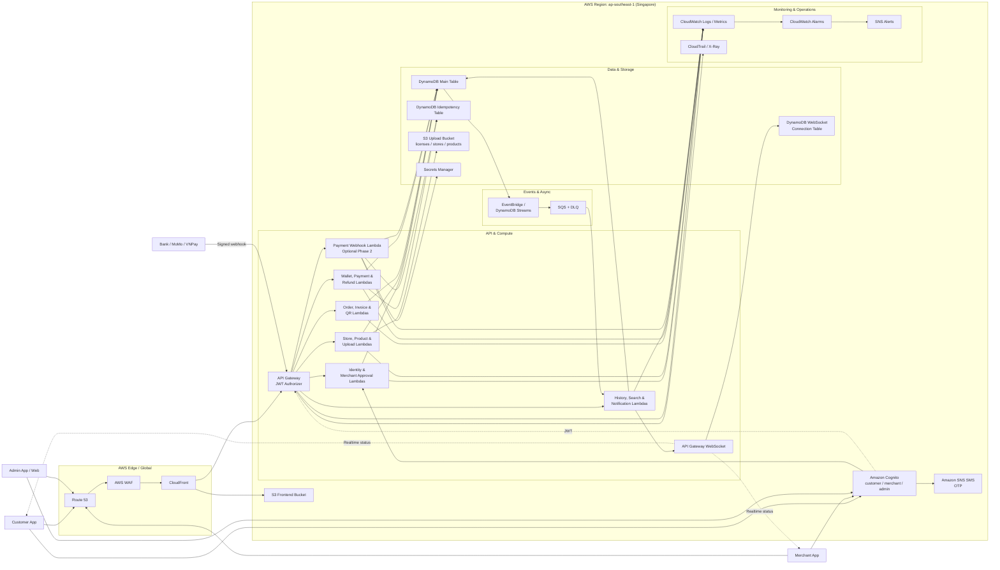

# Bản thiết kế kiến trúc hệ thống AWS BILLO

> Mục đích: mô tả kiến trúc mục tiêu để nhóm dùng làm cơ sở vẽ sơ đồ và triển khai dự án. Đây là thiết kế định hướng trước khi xây dựng, không phải bản kiểm kê tài nguyên AWS đang có.

## 1. Mục tiêu hệ thống

AWS BILLO là ứng dụng ví điện tử kết hợp POS cho cửa hàng, phục vụ ba nhóm người dùng:

- **Customer**: đăng ký tài khoản, quản lý ví, chuyển/nhận tiền, quét QR để thanh toán và xem lịch sử giao dịch.
- **Merchant**: đăng ký kinh doanh, quản lý cửa hàng và dịch vụ, tạo hóa đơn, nhận thanh toán QR/tiền mặt, theo dõi đơn hàng và hoàn tiền.
- **Admin**: duyệt hồ sơ kinh doanh, quản lý người dùng/cửa hàng và theo dõi hoạt động hệ thống.

Hệ thống ưu tiên kiến trúc serverless trên AWS, tự động mở rộng, phân quyền theo vai trò, giao dịch không bị xử lý trùng và có khả năng theo dõi sự cố.

## 2. Phạm vi sơ đồ tổng thể

Sơ đồ nên chia thành các vùng sau:

1. **Clients**
2. **Edge & Frontend Delivery**
3. **Authentication & Authorization**
4. **API & Compute**
5. **Data & Storage**
6. **Asynchronous & Realtime**
7. **External Integrations**
8. **Monitoring & Security**

Toàn bộ backend nghiệp vụ chính được triển khai trong Region `ap-southeast-1` (Singapore). Amazon CloudFront, Route 53 và AWS WAF nên được thể hiện là các dịch vụ edge/global, không nằm hoàn toàn bên trong khung Region.

## 3. Các thành phần trong sơ đồ

### 3.1. Clients

- Flutter Customer App.
- Flutter Merchant App/không gian kinh doanh.
- Flutter Admin App hoặc Admin Web.
- Các vai trò có thể dùng chung một ứng dụng Flutter và điều hướng giao diện theo Cognito group.

### 3.2. Edge và phân phối frontend

- **Amazon Route 53** quản lý domain.
- **Amazon CloudFront** phân phối Flutter Web và làm lớp truy cập thống nhất cho API nếu cần.
- **AWS WAF** gắn với CloudFront để chặn bot, IP xấu, request bất thường và giới hạn tần suất.
- **Amazon S3 Frontend Bucket** lưu bản build Flutter Web dạng static.
- Ứng dụng mobile có thể gọi API qua domain API/CloudFront; không tải giao diện từ S3.

Đây là lớp production. Trong MVP, ứng dụng có thể chạy local và gọi thẳng API Gateway.

### 3.3. Xác thực và phân quyền

- **Amazon Cognito User Pool** đăng ký, OTP, đăng nhập và phát hành JWT.
- Cognito groups: `customer`, `merchant`, `admin`.
- **Amazon SNS SMS** được Cognito sử dụng để gửi OTP.
- **Post Confirmation Lambda** tạo profile và ví mặc định khi customer xác nhận tài khoản.
- API Gateway JWT Authorizer xác minh chữ ký, issuer và audience của JWT trước khi chuyển request vào Lambda.
- Lambda tiếp tục kiểm tra role và quyền sở hữu tài nguyên ở cấp nghiệp vụ.

### 3.4. API và Lambda nghiệp vụ

- **Amazon API Gateway HTTP/REST API** nhận request HTTPS từ ứng dụng.
- **Auth & Profile Lambda**: hồ sơ người dùng, thông tin ví và profile.
- **Merchant Approval Lambda**: gửi hồ sơ kinh doanh; admin duyệt hoặc từ chối; thêm user vào group merchant.
- **Store & Product Lambda**: cửa hàng, menu/dịch vụ, hình ảnh và giá.
- **Order & Invoice Lambda**: giỏ hàng, hóa đơn, đơn tiền mặt, trạng thái đơn.
- **Payment Session Lambda**: tạo QR/session, xác nhận thanh toán và hết hạn session.
- **Wallet & Transfer Lambda**: số dư, chuyển tiền nội bộ và chống gửi lặp.
- **Transaction & History Lambda**: lịch sử, chi tiết giao dịch và bill.
- **Directory Search Lambda**: tìm người nhận và cửa hàng.
- **Upload Lambda**: cấp pre-signed URL để tải ảnh lên/xuống S3.
- **Webhook Lambda**: nhận callback có chữ ký từ cổng thanh toán bên ngoài, nếu tích hợp ở giai đoạn sau.

Trên sơ đồ tổng quan có thể gom các Lambda thành năm khối để dễ đọc:

1. Identity & Merchant Approval
2. Store, Product & Upload
3. Order, Invoice & QR
4. Wallet, Payment & Refund
5. History, Search & Notification

### 3.5. Dữ liệu và lưu trữ

- **DynamoDB Main Table** lưu profile, wallet, merchant application, store, product, order, payment session, transaction và directory index.
- **DynamoDB Idempotency Table** lưu idempotency key để chống tạo đơn/chuyển tiền/thanh toán trùng.
- DynamoDB Transaction và condition expression bảo đảm trừ tiền, cộng tiền, cập nhật hóa đơn và ghi lịch sử là một thao tác nguyên tử.
- **S3 Upload Bucket** lưu giấy phép kinh doanh, ảnh cửa hàng, logo, ảnh sản phẩm và QR xuất ra file nếu cần.
- DynamoDB chỉ lưu object key/metadata; ứng dụng truy cập ảnh bằng pre-signed URL hoặc CloudFront signed URL.
- Bật DynamoDB Point-in-Time Recovery, S3 encryption, versioning và lifecycle rule.

### 3.6. Realtime và xử lý bất đồng bộ

- **API Gateway WebSocket API** gửi trạng thái `PAID`, `EXPIRED`, `CANCELLED`, `REFUNDED` về merchant/customer theo thời gian thực.
- **Connection Table** trong DynamoDB lưu WebSocket connection ID theo user/order.
- **EventBridge hoặc DynamoDB Streams** phát sự kiện khi trạng thái order/payment thay đổi.
- **Notification Lambda** nhận sự kiện và đẩy cập nhật qua WebSocket.
- **SQS + DLQ** nên dùng cho công việc cần retry như gửi thông báo hoặc xử lý webhook.

Đối với MVP, có thể thay WebSocket bằng polling REST API mỗi 2-5 giây. Trên sơ đồ phải ghi rõ lựa chọn nào được áp dụng.

### 3.7. Tích hợp bên ngoài

- **Bank/MoMo/VNPay Payment Gateway** là phần mở rộng, không phải luồng bắt buộc của ví nội bộ.
- Payment Lambda tạo yêu cầu thanh toán với nhà cung cấp.
- Nhà cung cấp gọi HTTPS webhook vào API Gateway.
- Webhook Lambda kiểm tra chữ ký, timestamp, số tiền, merchant/order ID và idempotency key.
- Chỉ webhook hợp lệ mới được phép cập nhật trạng thái thanh toán.
- API key/secret của nhà cung cấp được lưu trong **AWS Secrets Manager**, không đặt trong frontend hoặc source code.

### 3.8. Monitoring, cảnh báo và bảo mật

- **Amazon CloudWatch Logs** nhận log từ API Gateway và Lambda.
- **CloudWatch Metrics/Dashboard** theo dõi lỗi 4xx/5xx, Lambda error/throttle/duration, số giao dịch lỗi và độ trễ webhook.
- **CloudWatch Alarms** gửi cảnh báo qua **Amazon SNS** đến email/đội vận hành.
- **AWS X-Ray** hoặc tracing tương đương theo dõi request xuyên API Gateway/Lambda.
- **AWS CloudTrail** ghi lại thao tác quản trị tài nguyên AWS.
- **AWS KMS** có thể dùng cho dữ liệu hoặc secret cần khóa mã hóa do dự án quản lý.
- IAM áp dụng least privilege cho từng nhóm Lambda.
- AWS Budgets cảnh báo chi phí môi trường dev/staging/prod.

## 4. Sơ đồ kiến trúc mục tiêu

## 5. Các luồng chính cần đánh số trên sơ đồ

### 5.1. Đăng ký và đăng nhập

1. User gửi số điện thoại và mật khẩu đến Cognito.
2. Cognito gửi OTP qua SNS SMS.
3. User xác nhận OTP.
4. Post Confirmation Lambda tạo profile và ví customer.
5. Cognito phát JWT sau khi đăng nhập.
6. Ứng dụng gửi JWT trong header `Authorization` khi gọi API.
7. API Gateway xác minh JWT; Lambda kiểm tra role nghiệp vụ.

### 5.2. Đăng ký kinh doanh

1. Customer yêu cầu pre-signed URL.
2. Ứng dụng upload giấy phép trực tiếp lên S3.
3. Customer gửi hồ sơ kèm object key vào API.
4. Merchant Approval Lambda lưu hồ sơ `PENDING` vào DynamoDB.
5. Admin xem hồ sơ và ảnh giấy phép.
6. Admin duyệt; hệ thống chuyển trạng thái `APPROVED`, thêm Cognito group merchant và tạo store.
7. User đăng nhập lại/refresh token để nhận quyền merchant.

### 5.3. Quản lý dịch vụ và hình ảnh

1. Merchant yêu cầu pre-signed URL và upload ảnh lên S3.
2. Merchant gửi tên, mô tả, giá và image object key.
3. Store & Product Lambda xác minh role/ownership rồi lưu sản phẩm vào DynamoDB.
4. Khi đọc sản phẩm, backend trả URL ảnh có thời hạn hoặc URL qua CloudFront.

### 5.4. Thanh toán QR bằng ví nội bộ

1. Merchant chọn dịch vụ và tạo order `WAITING_PAYMENT`.
2. Order Lambda đọc lại giá sản phẩm từ DynamoDB và tính tổng ở backend.
3. Payment Session Lambda tạo session có TTL và QR chứa session ID.
4. Customer quét QR và gọi API lấy hóa đơn.
5. Customer xác nhận thanh toán.
6. Wallet/Payment Lambda dùng DynamoDB Transaction để trừ ví customer, cộng ví merchant, đổi order/session thành `PAID` và ghi hai bản ghi lịch sử.
7. Sự kiện trạng thái được gửi qua WebSocket cho merchant/customer; MVP có thể polling thay thế.

### 5.5. Thanh toán qua cổng bên ngoài — giai đoạn 2

1. Backend tạo payment request và lưu order `PENDING_PROVIDER`.
2. Customer thanh toán trên Bank/MoMo/VNPay.
3. Nhà cung cấp gửi signed webhook.
4. Webhook Lambda xác minh chữ ký và chống xử lý trùng.
5. Backend cập nhật order thành `PAID` hoặc `FAILED`.
6. Event/Notification Lambda đẩy trạng thái về ứng dụng.

### 5.6. Hoàn tiền

1. Merchant/Admin gửi yêu cầu hoàn tiền.
2. Backend kiểm tra order đã thanh toán và chưa hoàn tiền.
3. Với ví nội bộ, DynamoDB Transaction đảo chiều số dư và cập nhật `REFUNDED`.
4. Với cổng ngoài, backend gọi refund API của nhà cung cấp và chờ webhook kết quả.
5. Hệ thống ghi lịch sử và thông báo hai bên.

## 6. Quy tắc khi thành viên vẽ sơ đồ

- Dùng **đường liền** cho request đồng bộ và **đường nét đứt** cho event, notification hoặc realtime.
- Mỗi mũi tên phải có động từ: `Authenticate`, `Verify JWT`, `Create order`, `Save transaction`, `Upload asset`, `Publish status`.
- Không vẽ DynamoDB nối thẳng đến S3; Lambda quản lý object key và quyền truy cập giữa hai dịch vụ.
- Không vẽ CloudWatch chủ động gọi Lambda. Lambda/API phát log/metric sang CloudWatch; Alarm mới gửi SNS.
- Không gọi condition expression là “lock”. Nên ghi `Atomic transaction + conditional update`.
- Trạng thái nên thống nhất: `WAITING_PAYMENT`, `PAID`, `CANCELLED`, `EXPIRED`, `REFUNDED`.
- Đánh dấu rõ `MVP` và `Phase 2/Production` bằng màu hoặc nét viền khác nhau.
- Nếu sơ đồ quá dày, tạo một sơ đồ tổng thể và bốn sơ đồ sequence riêng: authentication, merchant approval, QR payment và external webhook.

## 7. Phạm vi triển khai đề xuất

### MVP bắt buộc

- Cognito + OTP + role groups.
- API Gateway JWT Authorizer.
- Lambda nghiệp vụ.
- DynamoDB main/idempotency.
- S3 upload bằng pre-signed URL.
- Ví nội bộ, order, QR, lịch sử và admin approval.
- CloudWatch Logs.
- Polling trạng thái thanh toán.

### Production/Phase 2

- Route 53, CloudFront, WAF và frontend hosting.
- WebSocket realtime.
- EventBridge/Streams, SQS và DLQ.
- Bank/MoMo/VNPay webhook.
- Secrets Manager.
- CloudWatch dashboard, alarms, SNS alerts, X-Ray và CloudTrail.
- CI/CD, staging/prod, backup test, rate limit và fraud control.
